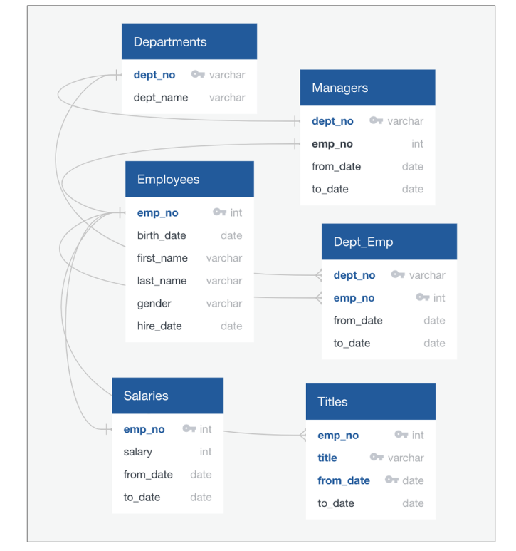
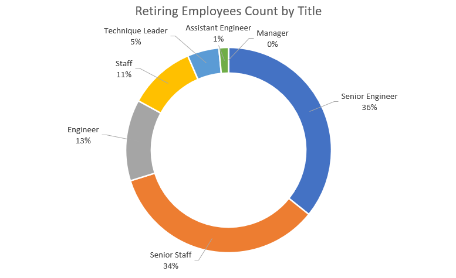
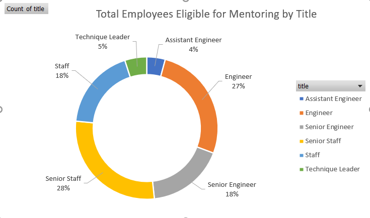
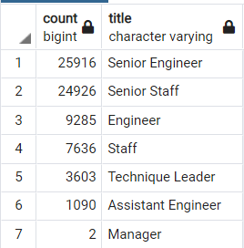
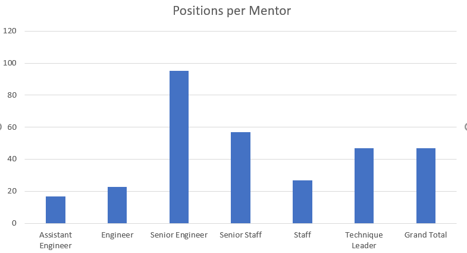

# Pewlett-Hackard Analysis (Module 7)

[Link to pgAdmin SQL code](Employee_Database_challenge.sql)

[Link to retirements titles csv](Data/retiring_titles.csv)

[Link to unique titles csv](Data/unique_titles.sql)

[Link to retiring titles csv](Data/retiring_titles.csv)

[Link to mentorship eligibility csv](Data/mentorship_eligibility.csv)

## Overview of Pewlett-Hackard Analysis

### Purpose
Created a SQL database and completed an analysis of Pewlett-Hackard employment records to:
* Determine the number of retiring employees per title
* Identify employees who are eligible to participate in a mentorship program

Provided the following data tables:

1. List of employees retiring by title
2. Count of employees retiring by title
3. List of table of employees eligible to participate in the mentorship program

### Resources

This project was prepared using the following:
* PostgreSQL version 11.15-2
* pgAmdin 4 version 6.7

Source data provided by Pewlett-Hackard, see ERD below:

## Pewlett-Hackard Results

Four major points from the two deliverables are:
1. Approximately 72,500 employees are eligible to retire.
2. Of the retiring employees, 36% are Senior Engineers and 34% are Senior Staff.  So, 70% of the retiring employees are senior staff.

3. Approximately 1,550 employees are eligible to participate in the mentoring program.
4. Of the eligible employees, 27% are Engineers and 28% are Senior Staff.

### Summary Conclusions:
How many roles will need to be filled as the "silver tsunami" begins to make an impact?

* The following table shows how many roles will need to be filled.

Are there enough qualified, retirement-ready employees in the departments to mentor the next generation of Pewlett-Hackard employees?

* Based on an assumption that a mentor can be most successful working with a group of up to 50 employees, Pewlett-Hackard may have a shortage of retirement-ready         employees to mentor Senior Engineer and Senior Staff positions.

Two additional queries or tables that may provide additional insight are:
* An assessment of new-hire progression in the company, both by salary growth and title promotions
* An assessment of how many employees have left the company within five years of starting and a root-cause analysis
